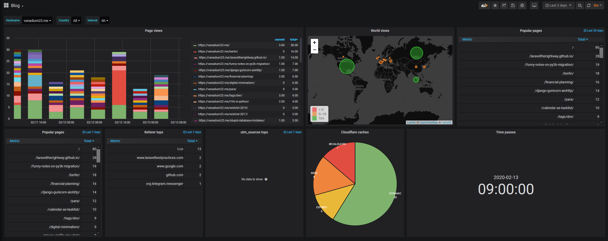

# Cloudflare metrics worker

Send your page views from [Cloudflare worker](https://developers.cloudflare.com/workers/) to InfluxDB.



## Requirements

1. Your site need to be setup behind Cloudflare CDN.
2. You need to setup InfluxDB with external access (make sure you have set [authentication](https://docs.influxdata.com/influxdb/v1.7/administration/authentication_and_authorization/#set-up-authentication))
   1. Make sure InfluxDB is hosted under [supported port](https://blog.cloudflare.com/cloudflare-now-supporting-more-ports/) for Workers. Best option is 80 or 443.

## How to use

1. Install wrangler package

```
npm i @cloudflare/wrangler -g
```

2. Copy example files

```
cp .env.example .env
cp wrangler.toml.example wrangler.toml
```

3. Deploy your worker to a site with wrangler

```
wrangler publish --env production
```

4. (Optional) If you're using Grafana with InfluxDB, then you can import [example Dashboard](static/dashboard.json) from first screen.
